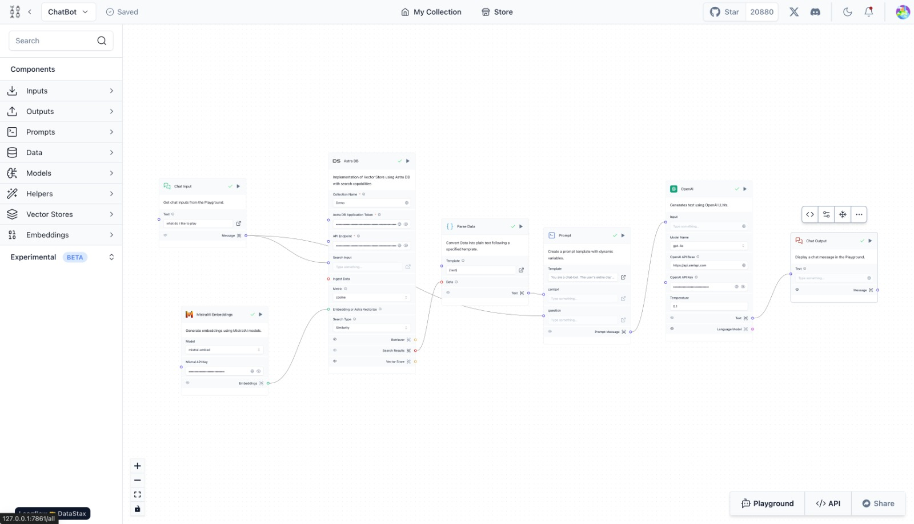
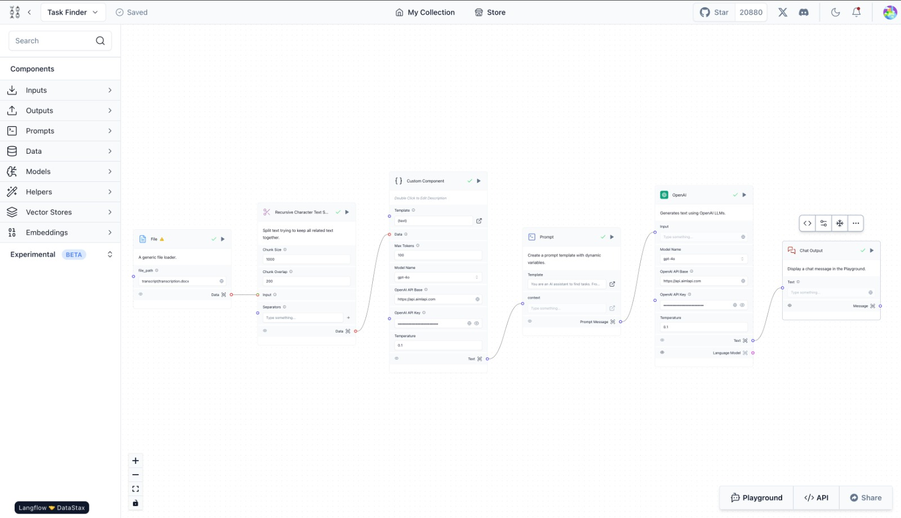

# CogniCare

CogniCare is a project designed to assist people with dementia by recording their daily conversations, processing them with a large language model (LLM) using Langflow, and providing a chatbot to answer questions and create to-do lists based on the conversations.

## Setup Instructions

### Prerequisites

1. **Python 3.8+**: Ensure you have Python installed. You can download it from [python.org](https://www.python.org/).
2. **Google Cloud Account**: Set up a Google Cloud account and enable the Speech-to-Text API.

### Clone the Repository

```bash
git clone https://github.com/SVyusti/CogniCare.git
cd CogniCare
```

### Install Dependencies

Create a virtual environment and activate it:

```bash
python -m venv venv
source venv/bin/activate   # On Windows use `venv\Scripts\activate`
```

Install the required packages:

```bash
pip install -r requirements.txt
```

### Google Cloud Speech-to-Text Setup

1. Create a new project in the Google Cloud Console.
2. Enable the Speech-to-Text API.
3. Create a service account and download the JSON key file.
4. Set the environment variable to authenticate with your service in the .env file

```bash
GOOGLE_APPLICATION_CREDENTIALS="path/to/your/service-account-file.json"
```

### Running Langflow and Streamlit

Start Langflow:

```bash
python -m langflow run
```

In a separate terminal, start the Streamlit app:

```bash
streamlit run 🏠_Dashboard.py
```

### Project Structure

```bash
cognicare/
│
├── 🏠_Dashboard.py # Main Streamlit app
├── requirements.txt # Python dependencies
├── README.md # Project documentation
└── ...
```

### Langflow Workflows

Chatbot Workflow



DataStore Workflow


TaskFinder Workflow



### Usage

1. Record Conversations: Use any device to record the daily conversations of the person with dementia.
2. Convert Voice to Text: Use Google Cloud Speech-to-Text API to transcribe the recordings.
3. Analyze Text: Send the transcriptions to Langflow for analysis and based on that generate a To-Do list for the day.
4. Chatbot Interaction: The chatbot, powered by the LLM, will answer questions regarding the day and create to-do lists based on the analyzed conversations.

### Contributing

1. Fork the repository.
2. Create a new branch (git checkout -b feature-branch).
3. Commit your changes (git commit -am 'Add new feature').
4. Push to the branch (git push origin feature-branch).
5. Create a new Pull Request.

### License

This project is licensed under the MIT License.

### Contributors

| [Vyusti Singamsetti](https://github.com/SVyusti) | | [Shobhit Tomer](https://github.com/ShobhitTomer) |
